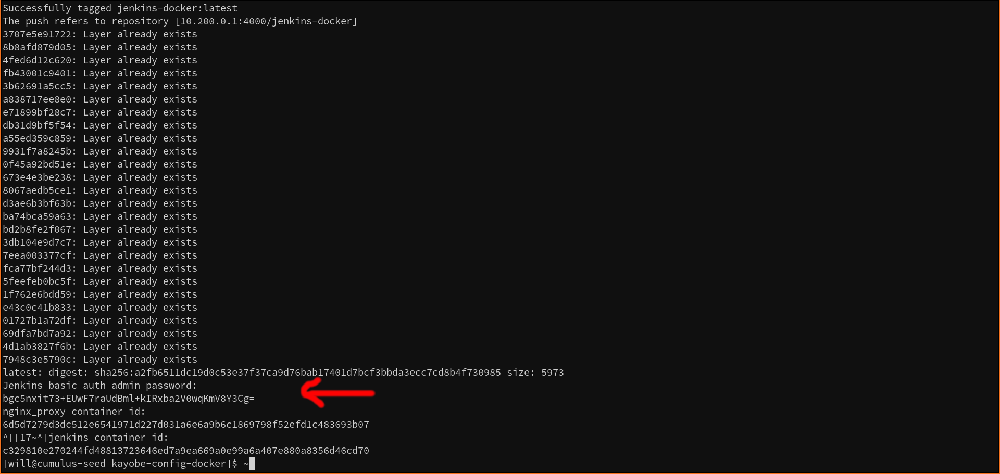
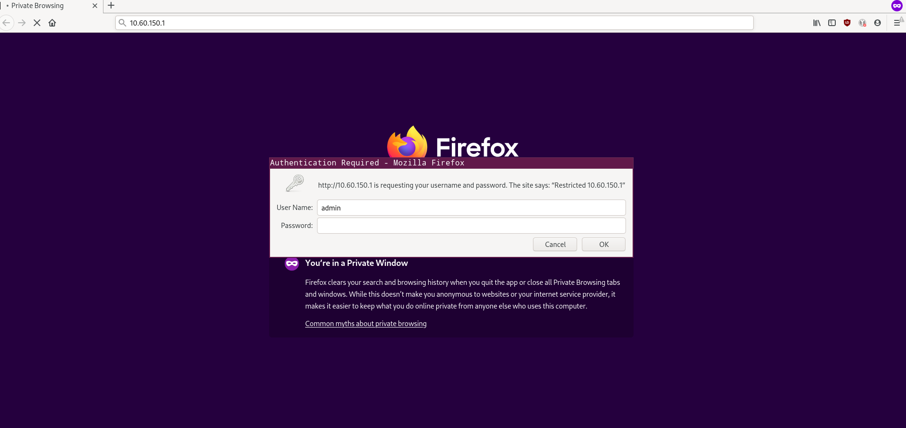
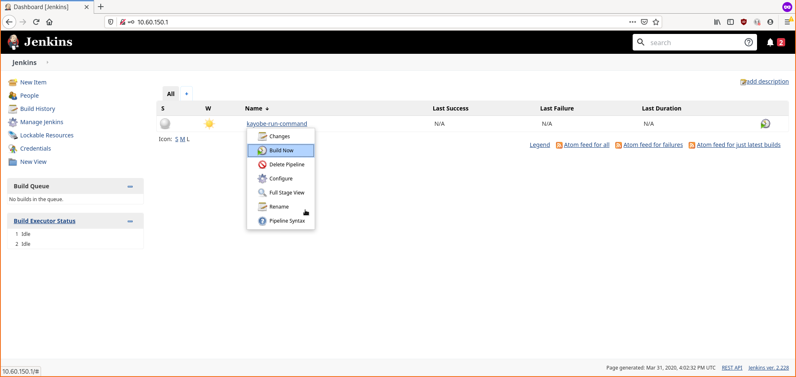
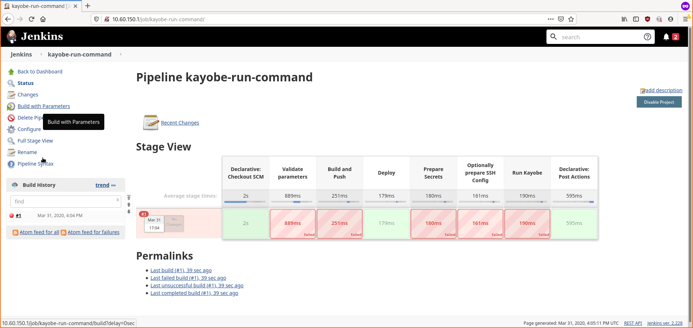
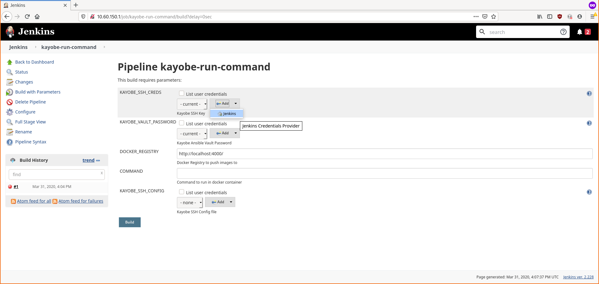
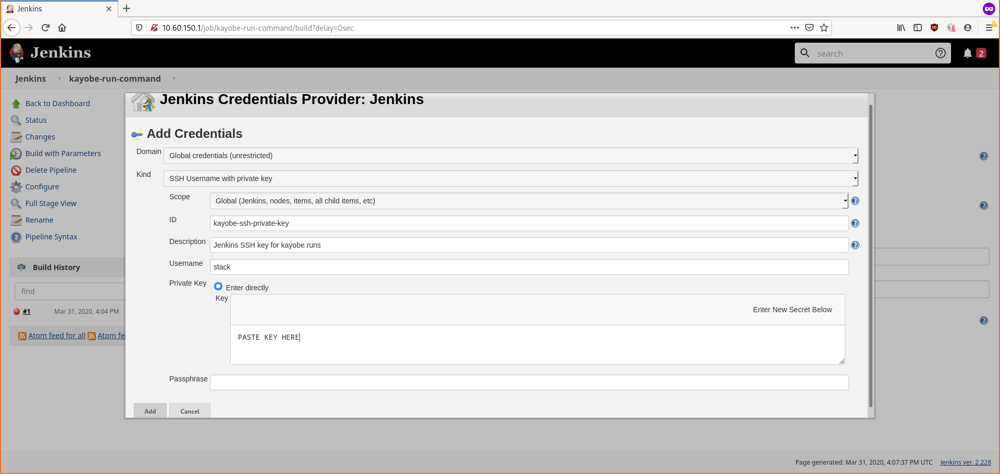
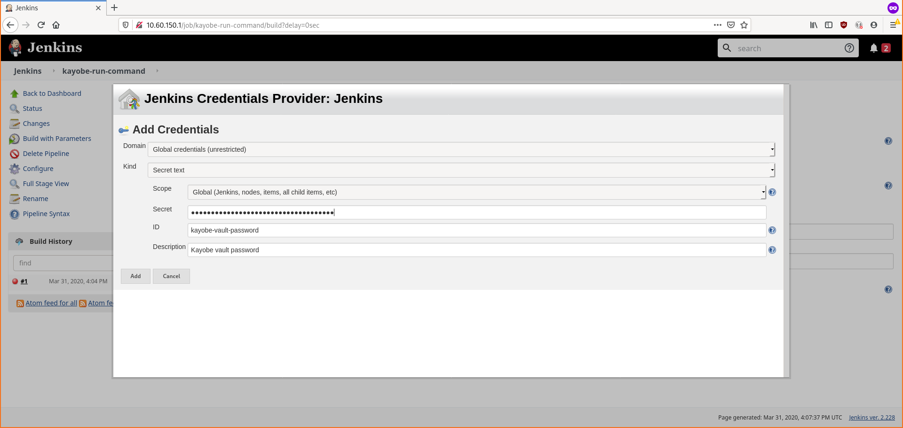
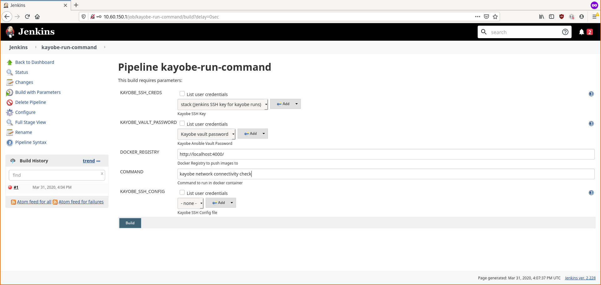

Kayobe-Config-Docker
####################

A reference jenkins setup to run kayobe commands from a seed host.

How to use
----------

First add the contents of the `kayobe-docker` directory
to the root of your Kayobe-Config repo like so::
    kayobe_config/
    ├── Dockerfile
    ├── Jenkinsfile
    ├── docker-entrypoint.sh
    ├── ansible.cfg

If an `ansible.cfg` file already exists in the kayobe-config
repo then this file will need to be merged.

Don't forget to add and commit the changes to the branch
you wish to deploy. Eventually this will be upstream in
the kayobe_config templates.

Next, edit the contents of jenkins_config (if necessary)
and ensure the following:

 * The location url in `jenkins.yaml` should match the seed IP:
    ``url: "http://192.168.33.5/"``

 * The url and branch lines of the pipeline script should match 
   the Kayobe-Config repo (and branch) you wish to deploy::
    url('https://github.com/Wasaac/a-universe-from-nothing')
    branch('*/monasca-stein-dockerise')

Deploying
---------
Copy or clone this repo (with your changes) onto a Kayobe
seed node and run ``jenkins_setup.sh`` as a user with both sudo
and docker privileges.

Post configuration and running an initial job
---------------------------------------------

* Retrieve the secret from the output of ``jenkins_setup.sh``:



* Navigate to the address set using ``jenkins_virtual_host`` and
  enter the password from the previous step (the username is admin):



* Start a build to trigger the initial import of the job:



NOTE: The initial build will fail as it lacks some necessary parameters.

* Navigate to the job and press ``Build with parameters``:



* Add an SSH private key by clicking ``jenkins`` under the ``Add`` button:



* Fill in the details as shown in the screenshot below:



* Add a ``secret text`` credential for the kayobe vault password:



* Start a run with a command of your choice. In the example we are
  running: ``kayobe network connectivity check```:



TODO
####

Replace setup script with ansible playbook and template jenkins config.
